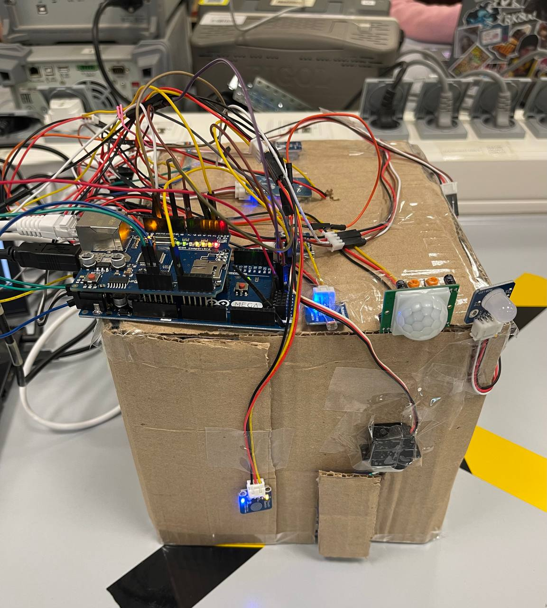

# Smart House IoT System
Rakhat Khamitov, Yelnaz Rysbek, Yelzhan Duisebay | Lab section 5 group 6

## Description
The goal of the project was to make an IoT system via which the owner of the house could
monitor metrics such as temperature, humidity, hazardous gas leaks, and also whether there is a
fire. We also included elements of the smart house, such as automatic doors, and lights that work
if there is a motion in the house or near it.

## Used Materials
1. Arduino board and breadboard
2. 1 servo motor for the automatic door
3. Flame sensor to detect the fire
4. Motion detector to detect the motion near the house
5. Temperature & Humidity sensor
6. 3 RGB LEDs
7. Buzzer
8. Photoresistor
9. Ethernet shield
10. 2 touch sensors
11. Wires
12. VEX metal structural pieces

## The physical look of the house
 

## The metrics display:

## Description of work:
To achieve the functionality of the house and at the same time reduce the interaction of the owner of the house with the internal work of the system, we decided to put the Arduino board on the roof of the house (it can be turned into the attic after) and the board is located outside the house as well (can be hidden with an additional building). The functionality of the house is the following:  
1. When the motion is detected outside of the house using a motion sensor (1) and it is dark outside (detected using a photoresistor (7)) the outside light turns on.  
2. When the person touches the touch sensor (13) the door will be opened. This is achieved using servo motor (10).  
3. Inside the house, when the person touches the touch sensor (12), the lights (3) will turn on.  
4. The gas sensor (6) located on the ceiling of the house will detect the leaks of gas such as propane, methane, and smoke. The owner can monitor on the dashboard at AskSensors (connected to via Ethernet shield (11)) if the level of gas is acceptable.  
5. The humidity and temperature sensor (4) is located on the wall and the information on it can also be observed in the dashboard at AskSensors.  
6. The flame sensor (5) is also located on the internal wall of the house, and the owner can also observe whether there is a flame in the dashboard at AskSensors. The buzzer (14) turns on if there is a fire.
